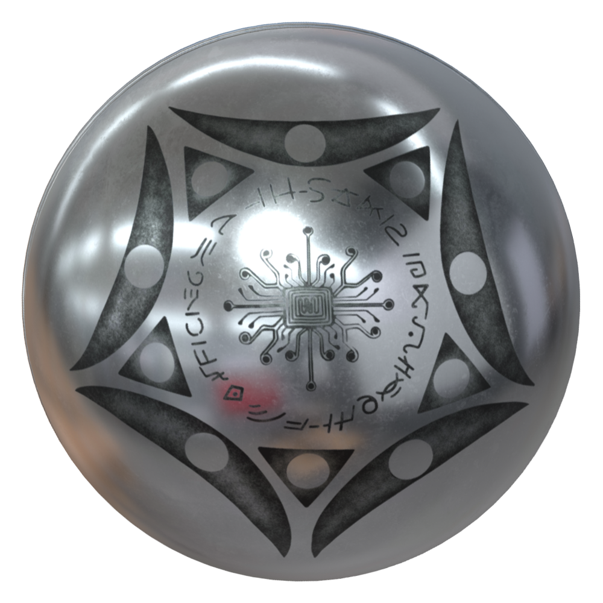

# BugaSphere Five-Phase Experience  
### Designed by **Seyedrasool Sadrieh (@Mesgona)**  
*Los Angeles — November 2025*

The **BugaSphere Five-Phase Experience** is a fullscreen Java application that synchronizes **breathing cycles**, **color phases**, **audio tones**, and **pentagon rotation** into one immersive meditative system. Each of the five phases—**Origin, Growth, Peak, Decline, Renewal**—represents **one full breath** (inhale + exhale), with visuals and sound perfectly aligned.

Built for deep breathing, coherence, meditation, focus enhancement, and nervous-system regulation.

---

## ✨ Features

### Five Fully-Synced Phases  
- Origin → Growth → Peak → Decline → Renewal  
- Each phase = *one inhale + one exhale*  
- Matching color, tone, rotation, and background  

### Breath Styles  
- **Coherent:** 50% inhale / 50% exhale  
- **Relaxed:** 60% inhale / 40% exhale  
- **Deep Calm:** 67% inhale / 33% exhale  

### Speed Modes (Loop = 5 phases)  
- **IGNITE** — 10 seconds  
- **BALANCE** — 20 seconds  
- **HARMONY** — 30 seconds  
- **ZEN** — 60 seconds  
- **TRANSCEND** — 120 seconds  

### Transition Types  
- **Hard Cut:** Instant color/tone change  
- **Soft Fade:** Smooth blend for last ~600ms of phase  

### Rotation Modes  
- **Continuous**  
- **Kinetic 72°** (snaps per phase)  
- **No Motion**  

### HUD Modes  
- **On:** Phase name, breath indicator (INHALE/EXHALE), timers, mode labels  
- **Off:** Pure immersive visuals + audio  

### Audio Engine  
- Smooth tone synthesis  
- Micro-attack/release envelopes  
- Stereo inhale/exhale shaping  
- Zero-click crossfading  

---

## 🎮 Controls

### Global  
- **Space** — Pause / Resume  
- **H** — Toggle HUD  
- **F11** or **Alt+Enter** — Fullscreen  
- **Esc** — Exit or leave fullscreen  

### Breath Style  
- **Q** — Coherent 50/50  
- **W** — Relaxed 60/40  
- **E** — Deep Calm 67/33  

### Speed  
- **1** — IGNITE (10s)  
- **2** — BALANCE (20s)  
- **3** — HARMONY (30s)  
- **4** — ZEN (60s)  
- **5** — TRANSCEND (120s)  

### Transition  
- **T** — Hard  
- **Y** — Soft  

### Rotation  
- **7** — Continuous  
- **8** — Kinetic 72°  
- **0** — No Motion  

---

## 🚀 How to Run

### Run in IntelliJ IDEA  
1. Install **Java 17+** (Java 21 recommended).  
2. Open IntelliJ → **Open Project**.  
3. Select the folder containing `BugaSphereFivePhaseExprience.java`.  
4. Go to:  
   **File → Project Structure → Project → SDK = 17 or higher**  
5. Right-click the file → **Run 'BugaSphereFivePhaseExprience.main()'**.

### Compile via Terminal  
```bash
javac BugaSphereFivePhaseExprience.java
java BugaSphereFivePhaseExprience
```
---

---

## 📖 Article

**The Geometry That Speaks: Unlocking the Code of the Buga Sphere**  
[Read the full article](https://docs.google.com/document/d/e/2PACX-1vRuL7N4Wrp5vvot5scHgBkncQeMywPdjBxEj2fRn7Y3fZuGwUL5BPrEQvVXnra9jzE2YT03g9EaUanr/pub)


---
# 🌌 BugaSphere – Five-Phase Encoder (Version 10)  
### *Instruction Guide*

---

## 🖼️ The Buga Sphere  




---

## ✨ Introduction  
### *The Story, Philosophy & Mystery of the BugaSphere*

The **BugaSphere** began with a single question:

> **“What if the rhythm of breath could be seen, felt, and understood through light and geometry?”**

From this question grew a sphere of living motion —  
a color-shifting, tone-resonating form that mirrors the cycles found in nature, emotion, and the human breath.

The BugaSphere is built on three ideas:

### **1. The Philosophy — Rhythm Creates Clarity**  
Every mind seeks order.  
Every breath seeks a pattern.  
The Sphere turns, glows, and shifts in a rhythm that gently guides your awareness back into balance.

### **2. The Mystery — A Mirror for Your Inner World**  
Something strange happens when you look at the Sphere long enough:  
you begin to feel as if it is breathing with you.

As its phases change, your breath naturally matches it — effortlessly.  
It becomes more than a visualization.  
It becomes a partner in your calm.

### **3. The Story — A Cycle as Old as Nature**  
The Five-Phase Encoder reflects a universal cycle:

**Origin → Growth → Peak → Decline → Renewal → Origin**

This is the cycle of breath,  
the cycle of emotion,  
the cycle of creativity,  
the cycle of life.

Each phase has a color, a tone, and a mood —  
and together, they create a loop of continuous renewal.

Version 10 brings this cycle into pure visual form —  
only breath, color, motion, and presence.

---

# 🌈 How to Use the Five-Phase Encoder (Version 10)
*A simple and friendly guide to help you get started quickly.*

---

## **1. Use the program exe file if not using Java**
Download the file Sphere.exe from repo to you PC and Double-click the Sphere.exe on Windows  
The Sphere will appear instantly.

No setup.  
No menus.  
No confusion.

---

## **2. Start or Pause the Motion**
Press **Space**:
- Start rotation  
- Pause rotation  

Color cycling continues even when paused.

---

## **3. Follow the Five Color Phases**
The Encoder progresses through:

**Origin → Growth → Peak → Decline → Renewal**

Each phase:
- has a unique color  
- plays a gentle frequency  
- shifts the pentagon  
- represents a breath moment  

You don’t have to count.

### 👉 Inhale when the Sphere brightens  
### 👉 Exhale when it softens  

Let the Sphere guide your breath naturally.

---

## **4. Toggle the HUD**
Press **H** to hide all text and controls.

This enters **Pure Experience Mode**:
- Sphere  
- Pentagon  
- Glow points  

Nothing else.

Perfect for meditation.

---

## **5. Sound On/Off**
Press **S** to mute or enable frequencies.

---

## **6. Fullscreen**
Press:
- **F** or  
- **F11**

for full immersion.

---

## **7. Exit**
Press **ESC** or close the window normally.

---

# 🌙 Final Note  
The BugaSphere is a companion —  
a geometric guide designed to help you return to your breath, calm, and inner balance.

Use it whenever you need:
- focus  
- a reset  
- a moment of peace  
- or a visual anchor to your breath  

The Sphere waits for you.  
And when you’re ready,  
it breathes with you.

---


